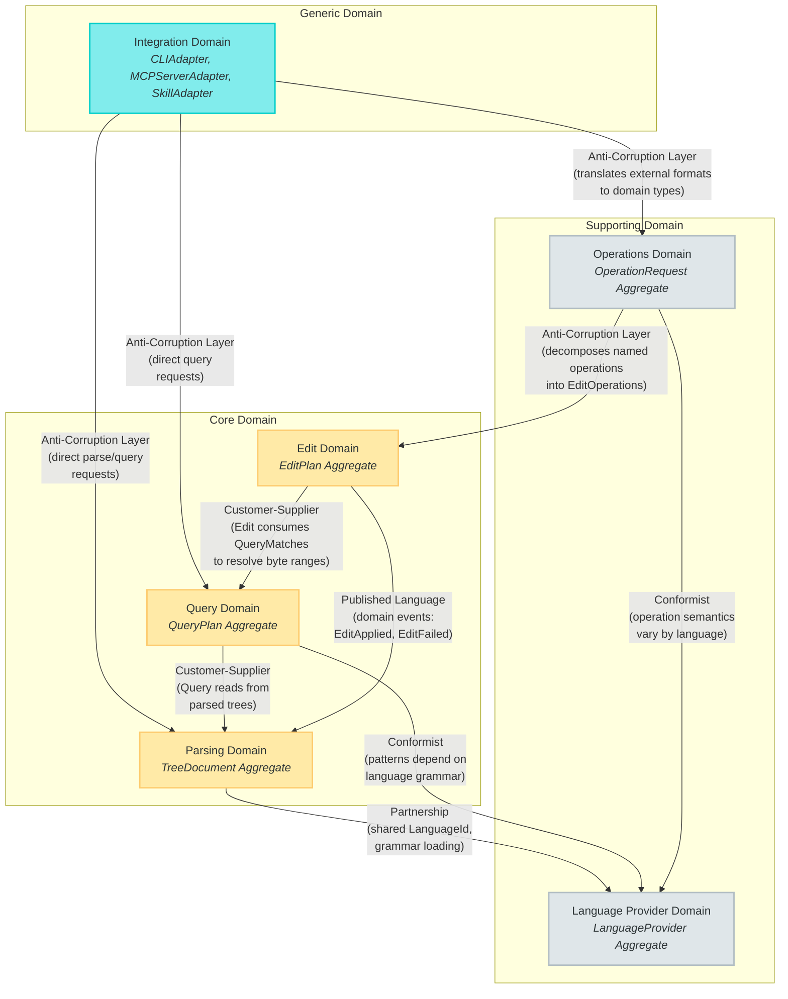
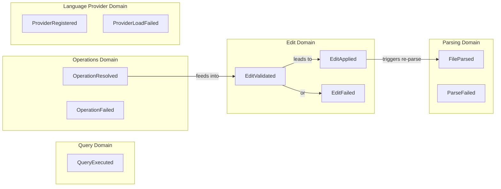
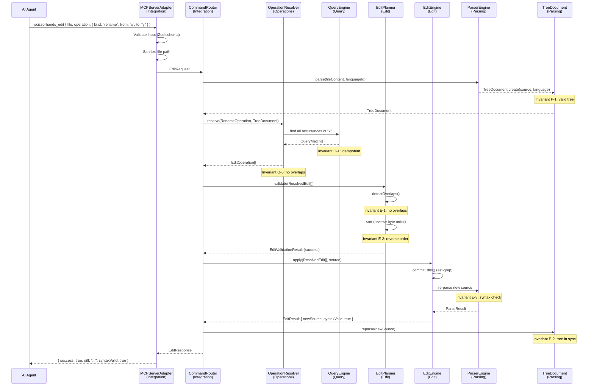

# Scissorhands: Domain-Driven Design Specification

## Overview

This document defines the domain model for Scissorhands, an AST-based polyglot code editor for AI agents. It follows Domain-Driven Design (DDD) strategic and tactical patterns to decompose the system into bounded contexts, define aggregates and their invariants, establish a ubiquitous language, and specify domain events for cross-context communication.

Scissorhands's core mission is to give AI agents the ability to perform targeted, structure-aware edits to source code across multiple programming languages. The domain naturally decomposes into six bounded contexts: Parsing, Query, Edit, Operations, Language Provider, and Integration.

---

## 1. Context Map

The following diagram shows all six bounded contexts and their relationships. Arrows indicate upstream/downstream dependencies, and annotations describe the integration pattern used at each boundary.



### Context Relationships Summary

| Upstream | Downstream | Pattern | Description |
|----------|------------|---------|-------------|
| Language Provider | Parsing | Partnership | Parsing and Language Provider collaborate tightly. Parsing delegates grammar loading and language detection to the provider. They share the `LanguageId` value object. |
| Language Provider | Query | Conformist | Query conforms to the pattern syntax and node type names defined by the language provider. Query cannot change the grammar; it adapts to it. |
| Language Provider | Operations | Conformist | Operation semantics (e.g., what constitutes a "function declaration" for extraction) vary by language. Operations conform to whatever the provider defines. |
| Parsing | Query | Customer-Supplier | Query is the customer. It requires a valid parsed tree from Parsing. Parsing exposes `TreeDocument` and does not depend on Query. |
| Query | Edit | Customer-Supplier | Edit is the customer. It uses Query to resolve pattern-based selectors to concrete byte ranges before applying edits. Query does not depend on Edit. |
| Operations | Edit | Anti-Corruption Layer | Operations translates high-level named operations (rename, extract, wrap) into the Edit domain's `EditOperation` value objects. This ACL prevents agent-facing abstractions from leaking into the edit engine. |
| Integration | Operations | Anti-Corruption Layer | Integration translates external formats (CLI arguments, MCP JSON-RPC, skill invocations) into `OperationRequest` aggregates. External protocol details do not leak into the domain. |
| Integration | Parsing/Query | Anti-Corruption Layer | For direct parse and query requests that do not involve editing, Integration translates external formats and routes directly to the Parsing or Query contexts. |
| Edit | Parsing | Published Language (Events) | When an edit is applied, Edit publishes `EditApplied` events. Parsing listens and invalidates/re-parses the affected `TreeDocument` to keep the tree in sync with the new source text. |

### Shared Kernel

The Parsing and Language Provider domains share a **Shared Kernel** consisting of:

- `LanguageId` value object (the canonical language identifier)
- `SourceRange` value object (byte offset + line/column positions)
- `NodeType` vocabulary (the set of AST node type names for a language)

Changes to these shared types require agreement from both contexts.

---

## 2. Bounded Contexts

### 2.1 Parsing Domain

**Classification**: Core Domain

**Responsibility**: Parse source files into abstract syntax trees, manage the lifecycle of parsed documents, and keep source text and parse trees in sync.

#### Aggregate Root: TreeDocument

A `TreeDocument` represents a parsed source file. It owns the source text, the parsed AST, and the language identity. It is the single authoritative representation of a file's structure within the system.

```typescript
class TreeDocument {
  readonly id: DocumentId;          // Value object: file path + content hash
  readonly languageId: LanguageId;  // Value object: canonical language identifier
  private sourceText: string;       // The raw source code
  private tree: ParseTree;          // The parsed AST (from ast-grep or tree-sitter)
  private version: number;          // Monotonically increasing version counter

  // Factory method: enforces the invariant that construction always produces a valid tree
  static create(source: string, language: LanguageId, parser: ParserEngine): TreeDocument;

  // Re-parse after source mutation. Replaces both sourceText and tree atomically.
  reparse(newSource: string, parser: ParserEngine): void;

  // Read-only access
  getSourceText(): string;
  getTree(): ParseTree;
  getLanguageId(): LanguageId;
  getVersion(): number;
  getRootNode(): ASTNode;
}
```

#### Value Objects

| Value Object | Description | Invariants |
|---|---|---|
| `DocumentId` | Identifies a TreeDocument. Composed of the file path and a content hash. Two documents with the same path but different content have different IDs. | File path is non-empty. Content hash is a valid SHA-256 hex string. |
| `SourceRange` | A span within source text, expressed as a byte offset range and line/column positions for both start and end. | `startByte <= endByte`. `startLine <= endLine`. If `startLine == endLine` then `startColumn <= endColumn`. All values are non-negative. |
| `ParseResult` | The outcome of parsing: either a success (containing the parse tree and any parser warnings) or a failure (containing parse errors). | A successful ParseResult always contains a non-null tree. A failed ParseResult always contains at least one error. |
| `LanguageId` | A canonical, lowercase language identifier string (e.g., `"typescript"`, `"python"`, `"go"`). | Must match a registered language in the LanguageProviderRegistry. Non-empty, lowercase, alphanumeric plus hyphens. |

#### Domain Service: ParserEngine

The `ParserEngine` wraps the underlying parsing backend (ast-grep NAPI for MVP, web-tree-sitter for Phase 2 fallback). It accepts source text and a language identifier, returning a `ParseResult`.

```typescript
interface ParserEngine {
  parse(source: string, language: LanguageId): ParseResult;
  supportsLanguage(language: LanguageId): boolean;
}
```

The `ParserEngine` is a domain service, not an entity. It is stateless -- it does not own the parsed tree. Ownership belongs to `TreeDocument`.

#### Repository: LanguageProviderRegistry

(Shared with the Language Provider Domain; see Section 2.5.)

The `LanguageProviderRegistry` is a repository that discovers, loads, and provides access to language providers. The Parsing domain uses it to resolve a `LanguageId` to the correct `ParserEngine` configuration.

```typescript
interface LanguageProviderRegistry {
  resolve(languageId: LanguageId): LanguageProvider | undefined;
  resolveByExtension(extension: string): LanguageProvider | undefined;
  register(provider: LanguageProvider): void;
  listRegistered(): LanguageId[];
}
```

#### Aggregate Invariants

1. **A TreeDocument always has a valid parse tree.** Construction via the factory method parses the source immediately. If parsing fails with fatal errors, the factory method throws. Partial parse trees (trees with error nodes) are acceptable -- the tree is structurally valid even if the source has syntax errors.

2. **Source text and tree are always in sync.** The `reparse()` method atomically replaces both the source text and the tree. There is no state where `sourceText` reflects edits that `tree` does not, or vice versa. The version counter increments on every reparse.

3. **LanguageId is immutable for the lifetime of a TreeDocument.** A file's language does not change. If you need to re-parse with a different language, create a new `TreeDocument`.

#### Domain Events

| Event | Trigger | Payload |
|---|---|---|
| `FileParsed` | A new TreeDocument is created or an existing one is re-parsed. | `{ documentId, languageId, version, parseTimeMs, hasErrors }` |
| `ParseFailed` | Parsing fails fatally (cannot produce any tree). | `{ filePath, languageId, errors[] }` |

---

### 2.2 Query Domain

**Classification**: Core Domain

**Responsibility**: Execute structural pattern queries against parsed trees, returning matched nodes with their source ranges and captured sub-expressions.

#### Aggregate Root: QueryPlan

A `QueryPlan` encapsulates a complete query specification: the pattern to match, the language it targets, and any scope constraints that limit the search area.

```typescript
class QueryPlan {
  readonly id: QueryPlanId;
  readonly pattern: PatternExpression;    // The structural pattern to match
  readonly language: LanguageId;          // Target language (determines pattern interpretation)
  readonly scope: NodeSelector | null;    // Optional: restrict matches to within this scope

  // Factory method: validates pattern syntax before construction
  static create(
    pattern: string,
    language: LanguageId,
    scope?: string
  ): QueryPlan;

  // Execute against a TreeDocument (delegates to QueryEngine)
  execute(document: TreeDocument, engine: QueryEngine): QueryMatch[];
}
```

#### Value Objects

| Value Object | Description | Invariants |
|---|---|---|
| `PatternExpression` | A validated structural pattern string in the target language's syntax (e.g., `"console.log($MSG)"` for TypeScript). May contain capture variables (`$NAME`, `$$$ARGS`). | Non-empty string. Syntactically valid for the target language (validated at construction). |
| `NodeSelector` | Identifies a set of AST nodes. Can be a pattern (structural match), a node type filter, or a byte range. Used to scope queries and target edits. | At least one selection criterion must be specified. |
| `QueryMatch` | A single match result: the matched AST node, its source text, its `SourceRange`, and a map of named captures to their text and ranges. | Source range references valid byte offsets within the document. All capture names are non-empty strings. The matched text equals the source text at the given range. |
| `QueryPlanId` | Uniquely identifies a QueryPlan. Derived from the pattern, language, and scope. | Deterministic: identical inputs produce identical IDs. |

#### Domain Service: QueryEngine

The `QueryEngine` executes structural patterns against an AST. It wraps ast-grep's `SgNode.find()` / `SgNode.findAll()` for the MVP, with a web-tree-sitter query fallback for Phase 2.

```typescript
interface QueryEngine {
  execute(plan: QueryPlan, document: TreeDocument): QueryMatch[];
  validatePattern(pattern: string, language: LanguageId): PatternValidationResult;
}
```

`PatternValidationResult` is either a success (pattern is syntactically valid) or a failure with diagnostic information (what is wrong and a suggested correction if possible).

#### Aggregate Invariants

1. **Queries are stateless and idempotent.** Executing the same `QueryPlan` against the same `TreeDocument` (same version) always produces the same set of `QueryMatch` results. The QueryEngine holds no mutable state between executions.

2. **Matches always reference valid byte ranges.** Every `QueryMatch.range` falls within `[0, document.sourceText.length)`. The text at that range in the document equals `QueryMatch.text`. This invariant is enforced by the QueryEngine at match construction time.

3. **Pattern syntax is validated eagerly.** A `PatternExpression` is validated at construction. An invalid pattern cannot be stored in a `QueryPlan`. This prevents runtime failures during query execution.

#### Domain Events

| Event | Trigger | Payload |
|---|---|---|
| `QueryExecuted` | A QueryPlan is executed against a TreeDocument. | `{ queryPlanId, documentId, matchCount, executionTimeMs }` |

---

### 2.3 Edit Domain

**Classification**: Core Domain

**Responsibility**: Resolve edit operations to concrete byte ranges, validate that edits do not conflict, apply edits to source text in the correct order, and verify that the result parses without new syntax errors.

#### Aggregate Root: EditPlan

An `EditPlan` represents an ordered, validated list of edit operations targeting a single file. It is the unit of atomicity for edits: either all operations in the plan succeed, or none are applied.

```typescript
class EditPlan {
  readonly id: EditPlanId;
  readonly documentId: DocumentId;
  private operations: EditOperation[];       // High-level operations (ordered)
  private resolvedEdits: ResolvedEdit[];     // Byte-range edits (computed lazily)
  private status: EditPlanStatus;            // draft | resolved | validated | applied | failed

  // Add an operation to the plan (only in 'draft' status)
  addOperation(operation: EditOperation): void;

  // Resolve all operations to byte-range edits using the QueryEngine
  resolve(document: TreeDocument, queryEngine: QueryEngine): void;

  // Validate: check for overlaps, compute application order
  validate(planner: EditPlanner): void;

  // Apply: produce new source text
  apply(document: TreeDocument, engine: EditEngine): EditResult;

  // Read-only access
  getOperations(): readonly EditOperation[];
  getResolvedEdits(): readonly ResolvedEdit[];
  getStatus(): EditPlanStatus;
}
```

#### Value Objects

| Value Object | Description | Invariants |
|---|---|---|
| `EditOperation` | A high-level edit specification with a `kind` discriminator (replace, rename, insert, remove, wrap, extract, move, raw) and kind-specific fields (pattern, replacement text, anchor, position, etc.). | `kind` is one of the recognized operation types. Required fields for the given kind are present and non-empty. |
| `ResolvedEdit` | A concrete, byte-range edit: `{ startByte, endByte, newText }`. This is the format consumed by ast-grep's `commitEdits()`. | `startByte <= endByte`. Both are non-negative and within the document's source length. `newText` is a string (may be empty for deletions). |
| `EditResult` | The outcome of applying an EditPlan: the new source text, the original source text, the list of changes applied, and a validity flag indicating whether the new source parses without syntax errors. | `newSource` is never null. `changes` has the same count as the resolved edits. `syntaxValid` is the result of re-parsing `newSource`. |
| `EditPlanId` | Uniquely identifies an EditPlan. | Non-empty. Unique within the system. |
| `EditPlanStatus` | One of: `draft` (accepting operations), `resolved` (operations resolved to byte ranges), `validated` (no conflicts, application order computed), `applied` (edits applied successfully), `failed` (edit application failed). | Status transitions follow the lifecycle: draft -> resolved -> validated -> applied/failed. No backwards transitions. |

#### Domain Services

**EditEngine**: Resolves `EditOperation` values to `ResolvedEdit` byte ranges (using the QueryEngine to find matching nodes), then applies the resolved edits to the source text using ast-grep's `commitEdits()`.

```typescript
interface EditEngine {
  resolve(operations: EditOperation[], document: TreeDocument, queryEngine: QueryEngine): ResolvedEdit[];
  apply(edits: ResolvedEdit[], source: string): string;
}
```

**EditPlanner**: Sorts, deduplicates, and validates a set of `ResolvedEdit` values. Detects overlapping ranges. Computes the correct application order (reverse byte order).

```typescript
interface EditPlanner {
  validate(edits: ResolvedEdit[]): EditValidationResult;
  sort(edits: ResolvedEdit[]): ResolvedEdit[];  // Returns edits in reverse byte order
  detectOverlaps(edits: ResolvedEdit[]): OverlapConflict[];
}
```

`EditValidationResult` is either a success (edits are non-overlapping and orderable) or a failure listing the specific `OverlapConflict` pairs.

#### Aggregate Invariants

1. **Edits must not overlap.** No two `ResolvedEdit` values in a validated `EditPlan` may have overlapping byte ranges. Overlapping edits cause the plan to enter the `failed` status with a descriptive error. This is a hard invariant -- the system does not attempt automatic conflict resolution.

2. **Edits are applied in reverse byte order.** When applying edits to a string, later byte positions are modified first so that earlier byte positions remain valid. The `EditPlanner.sort()` method enforces this ordering.

3. **The result must parse without syntax errors.** After applying all edits, the `EditEngine` re-parses the resulting source text. If the new source introduces syntax errors that were not present in the original, the `EditResult.syntaxValid` flag is set to `false`. Callers can choose to reject the result. (Note: this is a validation check, not a hard invariant that prevents application. Some edits intentionally produce intermediate states.)

4. **EditPlan status transitions are monotonic.** An EditPlan progresses through its lifecycle in one direction: `draft -> resolved -> validated -> applied` (or `failed` from any state). It cannot be reverted to a previous status. To retry, create a new EditPlan.

#### Domain Events

| Event | Trigger | Payload |
|---|---|---|
| `EditApplied` | An EditPlan is successfully applied. | `{ editPlanId, documentId, editCount, newSourceLength, syntaxValid }` |
| `EditFailed` | An EditPlan fails during resolution, validation, or application. | `{ editPlanId, documentId, reason, failedAtStatus, conflicts[] }` |
| `EditValidated` | An EditPlan passes validation (no overlaps). | `{ editPlanId, documentId, editCount }` |

---

### 2.4 Operations Domain

**Classification**: Supporting Domain

**Responsibility**: Translate high-level, agent-facing named operations (rename, extract, wrap, insert, remove) into the Edit domain's `EditOperation` value objects. This context exists to provide a convenient, intention-revealing API for AI agents without polluting the core Edit domain with operation-specific logic.

#### Aggregate Root: OperationRequest

An `OperationRequest` represents a high-level named operation submitted by an agent or user. It captures the intent (what the agent wants to do) without specifying the mechanical details (which byte ranges to modify).

```typescript
class OperationRequest {
  readonly id: OperationRequestId;
  readonly filePath: string;
  readonly operation: NamedOperation;  // One of the supported operation types
  readonly options: OperationOptions;  // dry-run, scope constraints, etc.

  // Decompose into EditOperations via the OperationResolver
  resolve(resolver: OperationResolver): EditOperation[];
}
```

#### Entities

Each named operation is an entity within this context. They share identity (by kind + parameters) and have behavior (decomposition logic).

| Entity | Description | Decomposes To |
|---|---|---|
| `RenameOperation` | Rename an identifier from `oldName` to `newName` within a scope. | One `replace` EditOperation per occurrence of the identifier. |
| `ExtractOperation` | Extract a matched expression into a named variable or function. | One `replace` (original site) + one `insert` (declaration) EditOperation. |
| `WrapOperation` | Wrap a matched node inside a new construct (e.g., try/catch, if-guard). | One `replace` EditOperation where the replacement contains the original matched text embedded in the wrapper template. |
| `InsertOperation` | Insert new code before, after, or inside a matched node. | One `insert` EditOperation at the resolved position. |
| `RemoveOperation` | Remove a matched node from the source. | One `replace` EditOperation with empty replacement text. |

#### Domain Service: OperationResolver

The `OperationResolver` is the core service of this context. It accepts a `NamedOperation` and decomposes it into one or more `EditOperation` value objects. This decomposition may require querying the tree to understand the structure around the target node (e.g., ExtractOperation needs to find the enclosing statement to know where to insert the variable declaration).

```typescript
interface OperationResolver {
  resolve(
    operation: NamedOperation,
    document: TreeDocument,
    queryEngine: QueryEngine,
    languageProvider: LanguageProvider
  ): EditOperation[];
}
```

#### Anti-Corruption Layer

The Operations domain serves as an **Anti-Corruption Layer** between the agent-facing world (where operations are described in terms of intent: "rename this", "extract that") and the Edit domain (where operations are described in terms of mechanics: "replace bytes 42-47 with this text").

```
Agent World                  Operations Domain              Edit Domain
─────────────               ─────────────────              ───────────
"rename x to y"  ──ACL──>  RenameOperation     ──ACL──>  [EditOperation, EditOperation, ...]
"extract to fn"  ──ACL──>  ExtractOperation    ──ACL──>  [EditOperation, EditOperation]
"wrap in try"    ──ACL──>  WrapOperation       ──ACL──>  [EditOperation]
```

This separation ensures that:
- The Edit domain remains agnostic to the meaning of "rename" or "extract"
- New operation types can be added without modifying the Edit domain
- Operation decomposition logic is isolated and independently testable

#### Aggregate Invariants

1. **An OperationRequest always targets exactly one file.** Multi-file operations are composed at a higher level (the Integration domain's batch API). Each OperationRequest decomposes into edits for a single file.

2. **Decomposition is deterministic.** Given the same OperationRequest and the same TreeDocument state, the OperationResolver always produces the same set of EditOperations.

3. **Decomposition never produces overlapping edits.** The OperationResolver is responsible for ensuring that the EditOperations it generates do not overlap. If decomposition would produce overlapping edits (e.g., a rename where two occurrences are adjacent), it adjusts the ranges to be non-overlapping.

#### Domain Events

| Event | Trigger | Payload |
|---|---|---|
| `OperationResolved` | An OperationRequest is decomposed into EditOperations. | `{ operationRequestId, operationKind, editOperationCount }` |
| `OperationFailed` | An OperationRequest cannot be decomposed (e.g., pattern matches nothing). | `{ operationRequestId, operationKind, reason }` |

---

### 2.5 Language Provider Domain

**Classification**: Supporting Domain

**Responsibility**: Encapsulate language-specific knowledge -- grammars, pattern syntax, node type mappings, and semantic conventions -- behind a uniform provider interface. This domain isolates the rest of the system from the details of individual programming languages and parsing backends.

#### Aggregate Root: LanguageProvider

A `LanguageProvider` represents a fully configured language support module. It bundles the grammar, patterns, node type mappings, and semantic rules for a single programming language.

```typescript
class LanguageProvider {
  readonly id: LanguageId;                      // Globally unique language identifier
  readonly extensions: readonly string[];        // File extensions (e.g., [".ts", ".tsx"])
  readonly patterns: LanguagePatterns;           // Pre-built structural patterns
  readonly nodeTypes: NodeTypeMap;               // Semantic node type mappings
  readonly semantics: LanguageSemantics;         // Language-specific rules

  // Check if this provider handles a given file extension
  handlesExtension(ext: string): boolean;
}
```

#### Entities

| Entity | Description | Backend |
|---|---|---|
| `AstGrepProvider` | A language provider backed by `@ast-grep/napi`. Uses ast-grep's built-in language support and pattern syntax. | `@ast-grep/napi` (MVP) |
| `TreeSitterProvider` | A language provider backed by `web-tree-sitter`. Loads `.wasm` grammar files. Uses S-expression queries internally, but exposes the same `LanguageProvider` interface. | `web-tree-sitter` (Phase 2) |

These entities implement the same `LanguageProvider` aggregate root interface but differ in their internal backend. The rest of the system is agnostic to which backend is used.

#### Value Objects

| Value Object | Description | Invariants |
|---|---|---|
| `LanguagePatterns` | A collection of pre-built structural patterns for common language constructs (function declarations, class declarations, variable declarations, imports, exports). Patterns use the target language's syntax. | Each pattern is a valid `PatternExpression` for the provider's language. |
| `NodeTypeMap` | Maps semantic concepts (function, class, variable, import, parameter, identifier) to the concrete AST node type names used by the grammar. | Each semantic concept maps to at least one node type string. |
| `LanguageSemantics` | Language-specific rules: whether the language is indentation-sensitive, comment syntax, string delimiters, statement terminators, block delimiters. | All fields are populated. Indentation-sensitivity is a boolean. |

#### Domain Service: GrammarLoader

Loads the grammar for a language. For ast-grep, this means configuring the correct `SgLang` enum value. For web-tree-sitter, this means loading the `.wasm` grammar file.

```typescript
interface GrammarLoader {
  load(languageId: LanguageId): GrammarHandle;
  isAvailable(languageId: LanguageId): boolean;
}
```

#### Aggregate Invariants

1. **Each provider handles a disjoint set of file extensions.** No two registered providers may claim the same file extension. The `LanguageProviderRegistry` enforces this at registration time and rejects duplicate extension claims.

2. **Provider ID is globally unique.** The `LanguageId` serves as the aggregate identity. No two providers may share the same `LanguageId`. Attempting to register a duplicate throws a `DuplicateProviderError`.

3. **Patterns are valid for their language.** Every `PatternExpression` in a provider's `LanguagePatterns` must be syntactically valid according to the provider's grammar. This is validated at provider construction time.

#### Domain Events

| Event | Trigger | Payload |
|---|---|---|
| `ProviderRegistered` | A new LanguageProvider is registered in the LanguageProviderRegistry. | `{ languageId, extensions[], backend }` |
| `ProviderLoadFailed` | A provider's grammar fails to load. | `{ languageId, backend, error }` |

---

### 2.6 Integration Domain

**Classification**: Generic Domain

**Responsibility**: Translate external inputs (CLI commands, MCP JSON-RPC tool calls, Claude Code skill invocations) into domain-level requests, and translate domain-level results back into external output formats.

#### Entities

| Entity | Description | External Protocol |
|---|---|---|
| `CLIAdapter` | Parses CLI arguments (via commander or similar), constructs `OperationRequest` or direct parse/query requests, formats results as terminal output or unified diffs. | POSIX CLI conventions, stdin/stdout |
| `MCPServerAdapter` | Implements the MCP server protocol. Maps `scissorhands_parse`, `scissorhands_query`, `scissorhands_edit`, and `scissorhands_batch` tool calls to domain requests. Returns JSON results. | MCP JSON-RPC over stdio |
| `SkillAdapter` | Wraps the library as a Claude Code skill. Maps skill invocations to domain requests. | Claude Code skill protocol |

#### Domain Service: CommandRouter

The `CommandRouter` is the central service of the Integration domain. It receives a normalized command (after the ACL has translated from the external format) and dispatches it to the appropriate domain context.

```typescript
interface CommandRouter {
  // Route a parse request to the Parsing domain
  parse(request: ParseRequest): Promise<ParseResponse>;

  // Route a query request to the Query domain
  query(request: QueryRequest): Promise<QueryResponse>;

  // Route an edit request through Operations -> Edit pipeline
  edit(request: EditRequest): Promise<EditResponse>;

  // Route a batch of edit requests atomically
  batch(request: BatchEditRequest): Promise<BatchEditResponse>;
}
```

#### Anti-Corruption Layer

The Integration domain's primary architectural role is as an **Anti-Corruption Layer** between the outside world and the domain model.

```
External World                Integration ACL              Domain Model
──────────────               ───────────────              ────────────
CLI args: "scissorhands edit     CLIAdapter parses args,      OperationRequest {
  --file src/auth.ts         constructs domain objects      file: "src/auth.ts",
  --rename                   with validated types            operation: RenameOperation {
  --from isValid                                               from: "isValid",
  --to isAuthenticated"                                        to: "isAuthenticated"
                                                             }
                                                           }

MCP JSON-RPC:                MCPServerAdapter              OperationRequest {
{                            deserializes JSON,              file: "src/auth.ts",
  "tool": "scissorhands_edit",   validates with Zod schema,      operation: RenameOperation {
  "input": {                 constructs domain objects          from: "isValid",
    "file": "src/auth.ts",                                     to: "isAuthenticated"
    "operation": {                                           }
      "kind": "rename",                                    }
      "from": "isValid",
      "to": "isAuthenticated"
    }
  }
}
```

The ACL is responsible for:
- **Input validation**: Rejecting malformed inputs before they reach the domain
- **Type translation**: Converting external representations (strings, JSON) to typed domain value objects
- **Error translation**: Converting domain exceptions to protocol-appropriate error responses
- **Path sanitization**: Preventing directory traversal and other filesystem attacks

#### Aggregate Invariants

The Integration domain has no aggregate roots (it is a purely translational layer), but it enforces boundary invariants:

1. **All external inputs are validated before entering the domain.** The ACL validates file paths, pattern syntax, operation parameters, and schema conformance. Invalid inputs are rejected with descriptive errors at the boundary.

2. **No domain types leak into external protocols.** The ACL translates domain events and results into protocol-specific formats. External clients never see `TreeDocument`, `EditPlan`, or other domain objects directly.

3. **File path sanitization.** All file paths received from external sources are resolved to absolute paths and validated against directory traversal attacks before being passed to the domain.

---

## 3. Ubiquitous Language

The following terms have precise meanings within the Scissorhands domain. All code, documentation, APIs, error messages, and discussions should use these terms consistently.

### Core Terms

| Term | Definition | Context |
|---|---|---|
| **TreeDocument** | The aggregate root of the Parsing domain. Represents a source file's text content together with its parsed AST and language identity. A TreeDocument is always in a consistent state: its tree reflects its source text. | Parsing |
| **ParseTree** | The concrete syntax tree produced by parsing source text. Contains AST nodes arranged in a parent-child hierarchy. Preserves all source information including whitespace and comments. | Parsing |
| **LanguageId** | A canonical, lowercase string identifier for a programming language (e.g., `"typescript"`, `"python"`). Used as the key for looking up language providers. | Shared Kernel |
| **SourceRange** | A span of text within a source file, defined by start and end positions. Each position has both a byte offset (for machine use) and line/column coordinates (for human display). | Shared Kernel |
| **PatternExpression** | A structural pattern written in the target language's syntax that matches AST nodes. Uses `$NAME` for single-node captures and `$$$NAME` for variadic (multi-node) captures. Example: `console.log($MSG)` matches all `console.log` calls in JavaScript/TypeScript. | Query |
| **QueryPlan** | The aggregate root of the Query domain. Encapsulates a pattern, a target language, and optional scope constraints. Executing a QueryPlan against a TreeDocument produces QueryMatch results. | Query |
| **QueryMatch** | A single result from executing a QueryPlan: the matched node, its source text, its SourceRange, and a map of named captures. | Query |
| **NodeSelector** | A specification for identifying AST nodes. Can be a PatternExpression (structural match), a node type filter, or a direct byte range. Used to target both queries and edits. | Query, Edit |
| **EditPlan** | The aggregate root of the Edit domain. An ordered, validated list of edit operations targeting a single file. The unit of atomicity: all operations succeed or none are applied. | Edit |
| **EditOperation** | A high-level edit specification with a `kind` (replace, rename, insert, remove, wrap, extract, move, raw) and kind-specific parameters. Resolved to byte-range ResolvedEdits before application. | Edit |
| **ResolvedEdit** | A concrete edit expressed as byte ranges: `{ startByte, endByte, newText }`. This is the format consumed by the underlying edit engine (ast-grep's `commitEdits()`). | Edit |
| **EditResult** | The outcome of applying an EditPlan: new source text, list of changes, and a validity flag indicating whether the new source parses without syntax errors. | Edit |

### Operations Terms

| Term | Definition | Context |
|---|---|---|
| **OperationRequest** | The aggregate root of the Operations domain. A high-level, agent-facing request to perform a named operation (rename, extract, wrap, etc.) on a single file. | Operations |
| **NamedOperation** | A tagged union of operation types (RenameOperation, ExtractOperation, WrapOperation, InsertOperation, RemoveOperation). Each carries the semantic parameters for its operation kind. | Operations |
| **OperationResolver** | The domain service that decomposes a NamedOperation into one or more EditOperations. This is the Anti-Corruption Layer between the Operations and Edit domains. | Operations |

### Language Terms

| Term | Definition | Context |
|---|---|---|
| **LanguageProvider** | The aggregate root of the Language Provider domain. Bundles grammar, patterns, node type mappings, and semantic rules for a single programming language behind a uniform interface. | Language Provider |
| **LanguagePatterns** | A collection of pre-built PatternExpressions for common constructs (functions, classes, variables, imports) in a specific language. | Language Provider |
| **NodeTypeMap** | Maps semantic concepts (function, class, variable, etc.) to concrete AST node type names used by the language's grammar. Bridges the gap between language-agnostic operation logic and language-specific tree structure. | Language Provider |
| **LanguageSemantics** | Language-specific metadata: indentation sensitivity, comment syntax, block delimiters, statement terminators. Used by operations that must generate syntactically correct code. | Language Provider |
| **GrammarLoader** | A domain service that loads the grammar for a language from the appropriate backend (ast-grep configuration or `.wasm` file). | Language Provider |

### Integration Terms

| Term | Definition | Context |
|---|---|---|
| **CommandRouter** | The domain service in the Integration context that dispatches normalized requests to the appropriate domain context (Parsing, Query, or Edit pipeline). | Integration |
| **Adapter** | An entity in the Integration context that translates between an external protocol (CLI, MCP, Skill) and the domain model. Each adapter implements the Anti-Corruption Layer for its protocol. | Integration |
| **Dry Run** | A mode of operation where edits are resolved, validated, and a diff is computed, but no file is written to disk. Allows agents to preview changes before committing. | Cross-cutting |

### Process Terms

| Term | Definition | Context |
|---|---|---|
| **Resolution** | The process of converting high-level EditOperations into concrete ResolvedEdits by querying the AST for matching nodes and computing byte ranges. | Edit |
| **Validation** | The process of checking that a set of ResolvedEdits do not overlap and can be applied in a consistent order. | Edit |
| **Application** | The process of producing new source text by applying ResolvedEdits to the original source, in reverse byte order. | Edit |
| **Decomposition** | The process of converting a NamedOperation into one or more EditOperations. Performed by the OperationResolver. | Operations |

---

## 4. Domain Events

Domain events are the Published Language used for communication between bounded contexts. Events are immutable records of something that happened in the domain. They flow from upstream to downstream contexts.

### Event Catalog



### Event Definitions

#### FileParsed

Published by the Parsing domain when a TreeDocument is created or re-parsed.

```typescript
interface FileParsed {
  readonly type: "FileParsed";
  readonly timestamp: Date;
  readonly documentId: string;
  readonly languageId: string;
  readonly version: number;
  readonly sourceLength: number;
  readonly parseTimeMs: number;
  readonly hasErrors: boolean;       // True if tree contains error nodes
  readonly errorCount: number;       // Number of error nodes in the tree
}
```

**Subscribers**: Query domain (may pre-warm caches), Edit domain (confirms tree is available).

#### ParseFailed

Published by the Parsing domain when source text cannot be parsed at all (fatal failure).

```typescript
interface ParseFailed {
  readonly type: "ParseFailed";
  readonly timestamp: Date;
  readonly filePath: string;
  readonly languageId: string;
  readonly errors: ParseError[];     // Descriptive error messages
}
```

**Subscribers**: Integration domain (reports error to user/agent).

#### QueryExecuted

Published by the Query domain after a QueryPlan is executed.

```typescript
interface QueryExecuted {
  readonly type: "QueryExecuted";
  readonly timestamp: Date;
  readonly queryPlanId: string;
  readonly documentId: string;
  readonly pattern: string;
  readonly matchCount: number;
  readonly executionTimeMs: number;
}
```

**Subscribers**: Telemetry (performance monitoring), Operations domain (logging).

#### EditValidated

Published by the Edit domain when an EditPlan passes validation.

```typescript
interface EditValidated {
  readonly type: "EditValidated";
  readonly timestamp: Date;
  readonly editPlanId: string;
  readonly documentId: string;
  readonly editCount: number;
}
```

**Subscribers**: Logging, audit trail.

#### EditApplied

Published by the Edit domain when an EditPlan is successfully applied.

```typescript
interface EditApplied {
  readonly type: "EditApplied";
  readonly timestamp: Date;
  readonly editPlanId: string;
  readonly documentId: string;
  readonly editCount: number;
  readonly originalSourceLength: number;
  readonly newSourceLength: number;
  readonly syntaxValid: boolean;     // Whether the result parses cleanly
}
```

**Subscribers**: Parsing domain (triggers re-parse of the affected TreeDocument to bring tree and source back into sync), Integration domain (reports result to user/agent).

**Key Flow**: `EditApplied -> Parsing domain re-parses -> FileParsed`. This event chain is what maintains the invariant that TreeDocument's tree always reflects its source text.

#### EditFailed

Published by the Edit domain when an EditPlan fails at any stage (resolution, validation, or application).

```typescript
interface EditFailed {
  readonly type: "EditFailed";
  readonly timestamp: Date;
  readonly editPlanId: string;
  readonly documentId: string;
  readonly reason: string;
  readonly failedAtStatus: EditPlanStatus;    // Which stage failed
  readonly conflicts: OverlapConflict[];      // If failed at validation
}
```

**Subscribers**: Integration domain (reports error to user/agent with actionable details).

#### OperationResolved

Published by the Operations domain when a NamedOperation is decomposed into EditOperations.

```typescript
interface OperationResolved {
  readonly type: "OperationResolved";
  readonly timestamp: Date;
  readonly operationRequestId: string;
  readonly operationKind: string;
  readonly editOperationCount: number;
}
```

**Subscribers**: Logging, Edit domain (receives the EditOperations to build an EditPlan).

#### OperationFailed

Published by the Operations domain when a NamedOperation cannot be decomposed (e.g., the target pattern matches nothing in the file).

```typescript
interface OperationFailed {
  readonly type: "OperationFailed";
  readonly timestamp: Date;
  readonly operationRequestId: string;
  readonly operationKind: string;
  readonly reason: string;
}
```

**Subscribers**: Integration domain (reports error to user/agent).

#### ProviderRegistered

Published by the Language Provider domain when a new provider is registered.

```typescript
interface ProviderRegistered {
  readonly type: "ProviderRegistered";
  readonly timestamp: Date;
  readonly languageId: string;
  readonly extensions: string[];
  readonly backend: "ast-grep" | "tree-sitter";
}
```

**Subscribers**: Parsing domain (new language available for parsing), Integration domain (updates supported language list).

#### ProviderLoadFailed

Published by the Language Provider domain when a provider's grammar fails to load.

```typescript
interface ProviderLoadFailed {
  readonly type: "ProviderLoadFailed";
  readonly timestamp: Date;
  readonly languageId: string;
  readonly backend: "ast-grep" | "tree-sitter";
  readonly error: string;
}
```

**Subscribers**: Integration domain (degrades gracefully, reports unavailable language).

---

## 5. Aggregate Invariants Summary

This section consolidates all aggregate invariants across bounded contexts for quick reference.

### Parsing Domain -- TreeDocument

| ID | Invariant | Enforcement |
|---|---|---|
| P-1 | A TreeDocument always has a valid parse tree. | Factory method parses immediately; throws on fatal failure. |
| P-2 | Source text and tree are always in sync. | `reparse()` atomically replaces both. Version counter increments. |
| P-3 | LanguageId is immutable for the lifetime of a TreeDocument. | `languageId` is `readonly`. No setter or mutation path. |

### Query Domain -- QueryPlan

| ID | Invariant | Enforcement |
|---|---|---|
| Q-1 | Queries are stateless and idempotent. | QueryEngine holds no mutable state. Same inputs produce same outputs. |
| Q-2 | Matches always reference valid byte ranges. | QueryEngine validates ranges at match construction time. |
| Q-3 | Pattern syntax is validated eagerly. | PatternExpression constructor validates syntax. Invalid patterns cannot be stored. |

### Edit Domain -- EditPlan

| ID | Invariant | Enforcement |
|---|---|---|
| E-1 | Edits must not overlap. | EditPlanner.detectOverlaps() runs during validation. Overlaps cause failure. |
| E-2 | Edits are applied in reverse byte order. | EditPlanner.sort() enforces descending byte order. |
| E-3 | Result must parse without syntax errors. | EditEngine re-parses after application. Sets `syntaxValid` flag on EditResult. |
| E-4 | EditPlan status transitions are monotonic. | Status is a state machine: draft -> resolved -> validated -> applied/failed. No backwards transitions. |

### Operations Domain -- OperationRequest

| ID | Invariant | Enforcement |
|---|---|---|
| O-1 | An OperationRequest targets exactly one file. | Constructor validates `filePath` is a single path. Multi-file operations are composed externally. |
| O-2 | Decomposition is deterministic. | OperationResolver is a pure function of (operation, tree state). No randomness or side effects. |
| O-3 | Decomposition never produces overlapping edits. | OperationResolver validates its output against overlap rules before returning. |

### Language Provider Domain -- LanguageProvider

| ID | Invariant | Enforcement |
|---|---|---|
| L-1 | Each provider handles a disjoint set of file extensions. | LanguageProviderRegistry rejects duplicate extensions at registration time. |
| L-2 | Provider ID is globally unique. | LanguageProviderRegistry rejects duplicate LanguageId at registration time. |
| L-3 | Patterns are valid for their language. | LanguageProvider constructor validates all patterns against the grammar. |

---

## 6. Request Lifecycle

The following sequence shows how a typical edit request flows through the bounded contexts, from an external MCP tool call to a modified file on disk.



---

## 7. Error Handling Strategy

Errors in Scissorhands are categorized by bounded context and severity. Each context defines its own error types, and the Integration domain's ACL translates them into agent-friendly messages.

### Error Hierarchy

```
ScissorhandsError (base)
  ParseError
    GrammarNotFoundError          -- No provider for the detected/specified language
    FatalParseError               -- Source text cannot be parsed at all
  QueryError
    InvalidPatternError           -- Pattern syntax is invalid for the language
    PatternMatchError             -- Internal error during pattern matching
  EditError
    OverlappingEditsError         -- Two or more edits have overlapping byte ranges
    EditResolutionError           -- Cannot resolve an EditOperation to byte ranges
    SyntaxValidationError         -- Edit result has syntax errors (warning, not fatal)
  OperationError
    NoMatchError                  -- Named operation's target pattern matches nothing
    DecompositionError            -- Cannot decompose operation into edits
  ProviderError
    DuplicateProviderError        -- Provider ID or extension already registered
    GrammarLoadError              -- Grammar file failed to load
  IntegrationError
    InputValidationError          -- External input fails schema validation
    PathTraversalError            -- File path attempts directory traversal
```

### Error Flow

Errors originate in their respective bounded contexts and flow outward through the Integration ACL:

1. Domain errors carry structured data (the overlapping ranges, the invalid pattern, the missing language)
2. The Integration ACL formats errors for the external protocol (CLI: human-readable with suggestions; MCP: JSON with error code and details)
3. Agents receive actionable error messages: what went wrong, why, and how to fix it

---

## 8. Phase Mapping

This section maps the DDD model to the project's implementation phases from PLAN.md.

| Phase | Bounded Contexts Active | Key Aggregates | Backend |
|---|---|---|---|
| **Phase 1 (Foundation)** | Parsing, Query, Language Provider | TreeDocument, QueryPlan, LanguageProvider (TS + Python) | `@ast-grep/napi` |
| **Phase 2 (Edit Engine)** | + Edit, Operations | + EditPlan, OperationRequest (replace, rename, insert, remove) | `@ast-grep/napi` |
| **Phase 3 (Integration)** | + Integration | + CLIAdapter, MCPServerAdapter, CommandRouter | `@ast-grep/napi` |
| **Phase 4 (Extended)** | All | + WrapOperation, ExtractOperation, MoveOperation; Go + Rust providers; TreeSitterProvider | `@ast-grep/napi` + `web-tree-sitter` (fallback) |

---

## 9. Design Decisions

### Why six bounded contexts instead of a monolithic model?

The operations in Scissorhands naturally separate by concern: parsing is about source-to-tree conversion, querying is about pattern matching, editing is about source-text mutation, and operations are about agent-intent translation. Merging these would create a "god object" that couples grammar knowledge with edit mechanics with CLI argument parsing. The bounded context boundaries prevent this coupling and allow each concern to evolve independently.

### Why is the Operations domain separate from Edit?

The Edit domain knows about byte ranges, overlap detection, and source-text mutation. It does not and should not know what a "rename" or "extract" means semantically. The Operations domain encodes that semantic knowledge and decomposes it into the Edit domain's language. This separation means new operation types (e.g., "inline variable", "convert to arrow function") can be added by extending the Operations domain alone, without touching the edit engine.

### Why use domain events instead of direct method calls between contexts?

Domain events decouple the contexts temporally and structurally. The `EditApplied` event triggers a re-parse without the Edit domain needing a reference to the Parsing domain. This makes the system testable (mock event handlers), extensible (new subscribers), and traceable (event log serves as an audit trail).

### Why is LanguageProvider an aggregate root and not just a value object?

Language providers have identity (the `LanguageId`) and lifecycle (they are registered, loaded, and potentially unloaded). They also enforce invariants (disjoint extensions, valid patterns). This qualifies them as aggregates, not mere value holders.
